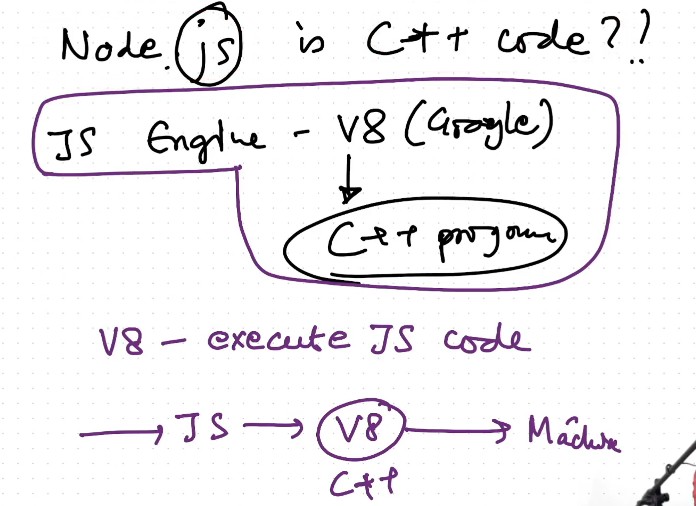
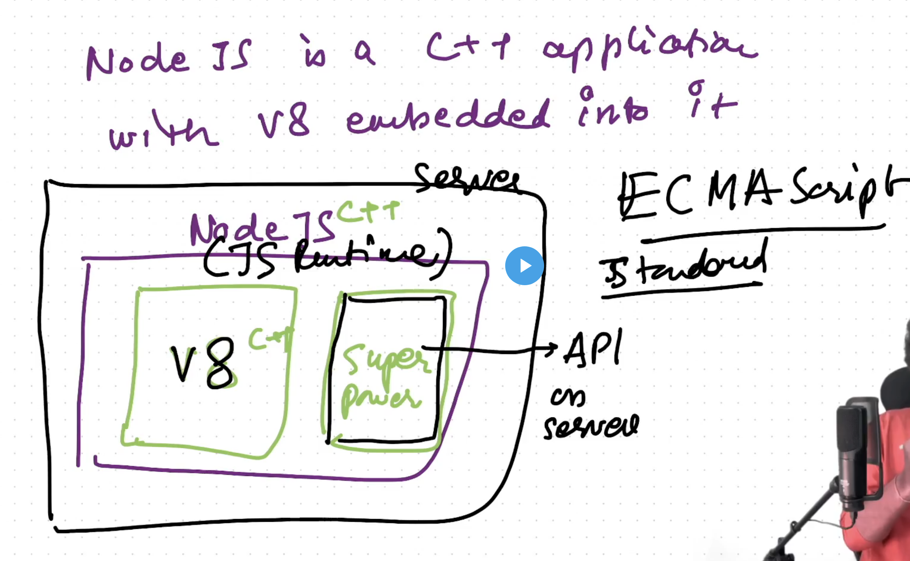
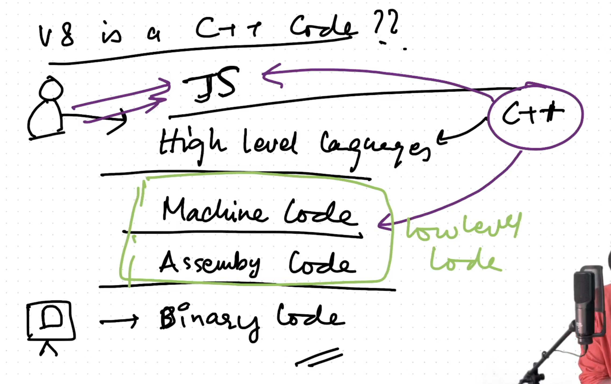

## EPISODE - 1: Introduction to NodeJS

For notes, visit the Namaste Dev NodeJS Notes section.

---

## EPISODE - 2: JS on Server

### What is a Server and Why Do We Need JS on the Server?

A server is a type of computer that runs remotely. We send requests to servers. With Node.js, we can run JavaScript on servers. This is useful because it allows a single JavaScript developer to work on both the frontend and backend, making them a **Full Stack Developer**.

**Important Points:**
- **V8 Engine:** V8 can be embedded in any C++ program.
  - JavaScript → V8 (C++) → Machine Language
- **Node.js Overview:**
  - Node.js is a C++ program with V8 embedded into it.
  - V8 executes JavaScript code, but Node.js provides additional features, such as APIs for server-side operations and communication with databases, which are not covered by the ECMAScript standards.
  

- **ECMAScript:**
  - ECMAScript is the scripting standard followed by all browser engines.
- **JavaScript Runtime:**
  - The combination of Node.js and the V8 engine is referred to as the JavaScript Runtime.
- **JavaScript Engine and V8:**
  - The JavaScript engine or V8 is a C++ program that follows ECMAScript standards and executes JavaScript in the browser.
- **Node.js Composition:**
  - Node.js consists of V8 plus JavaScript code.
- **Why V8 in C++?**
  
