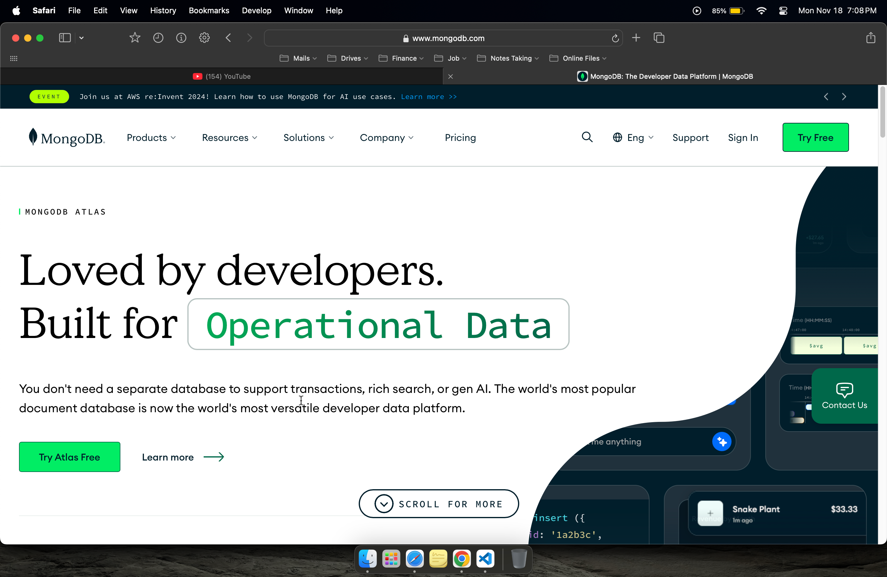
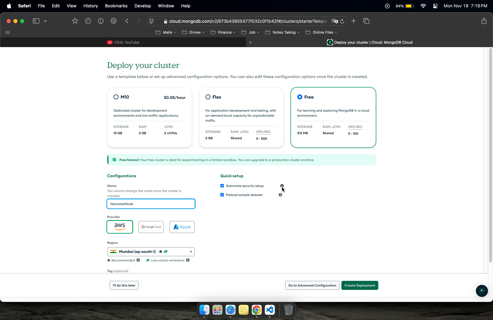
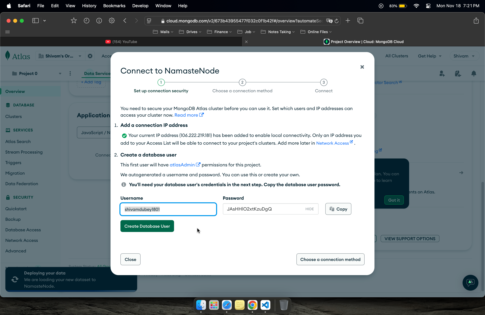
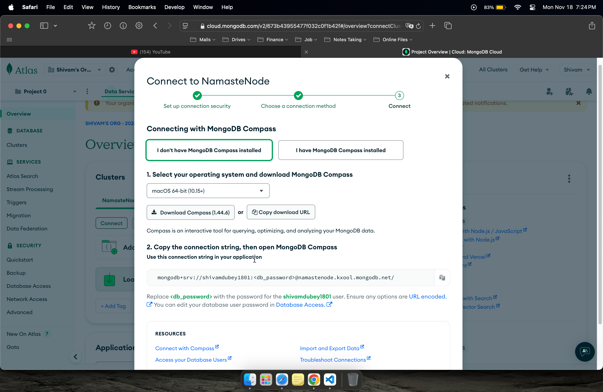
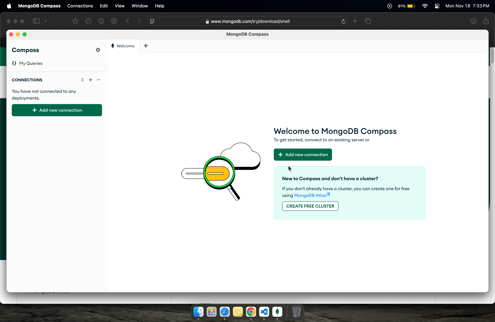
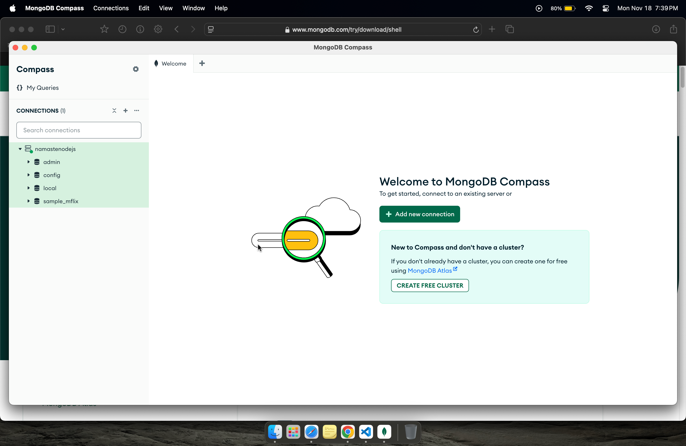
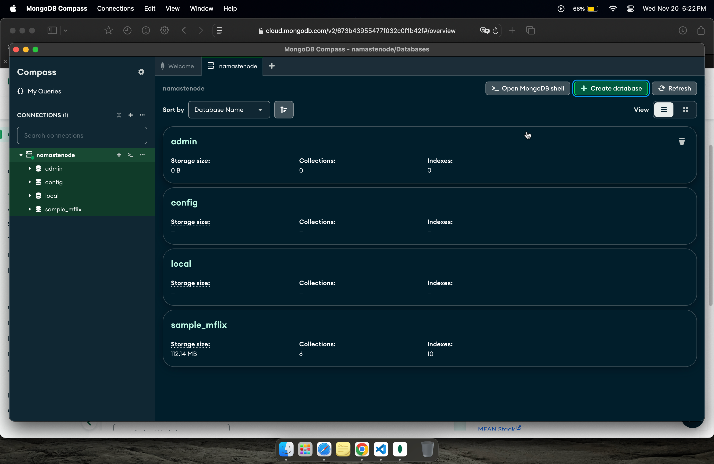
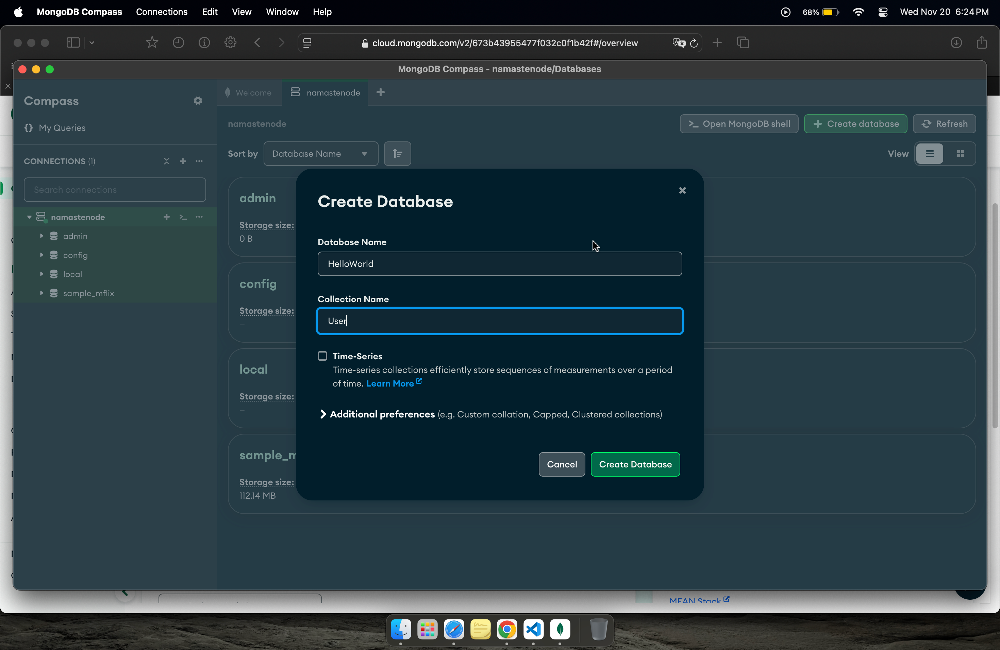
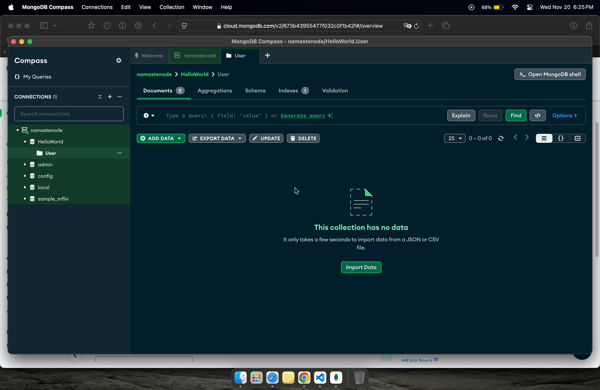

## Episode-13 | Creating a database & mongodb

Two ways to use MongoDB:- 
1. **Install the package and use it directly.**
2. **Self Managed Way**: - It will deploy the datatbase on a server and provide the access to that database. 

It is better to use the version that is managed by the MongoDB. 

#### Steps to use the MongoDB:- 

- Just signup and complete the survey.

- While selecting the server we can select the nearest region and also based on the majority of the users.
- Now click the deployment button.
- It will show **username shivamdubey1801 and password
JAsHHlO2xtKzuDgQ**.

- Now get the connection string 
- Click on connect and then on compass.

mongodb+srv://shivamdubey1801:<db_password>@namastenode.kxool.mongodb.net/

- Then replace the password with your password and this string is enough to connect to the database.

#### How to see the Database 

It can be done using the MongoDB Compass.

- Go to website of MongoDB Compass Website and download that software.

- After opening the app click on new connection, paste the connection string and then provide the name and color and click save and connect. We will get the datavase dashboard.

### Ways to create the database

1. It can be created using the compass by clicking on the create database button.
   
   
   
   - We can insert document in this databse.

2. Adding data to the database using code.
   - To do so we have to install the mongodb from npm using "npm install mongodb" 
   - Now in the npm mongodb goto to documentation and open the api docs 
   https://mongodb.github.io/node-mongodb-native/6.10/
   Here you can get the code for the connection.
   - Now here only we get so many methods with help of which we can read, insert, update delete and do many operations in the database.

**NOTE**:- IN the production we don't use the mongodb library but we use moongoose that just like we use express for creating the server.

For code refer the database.js file for code reference.

