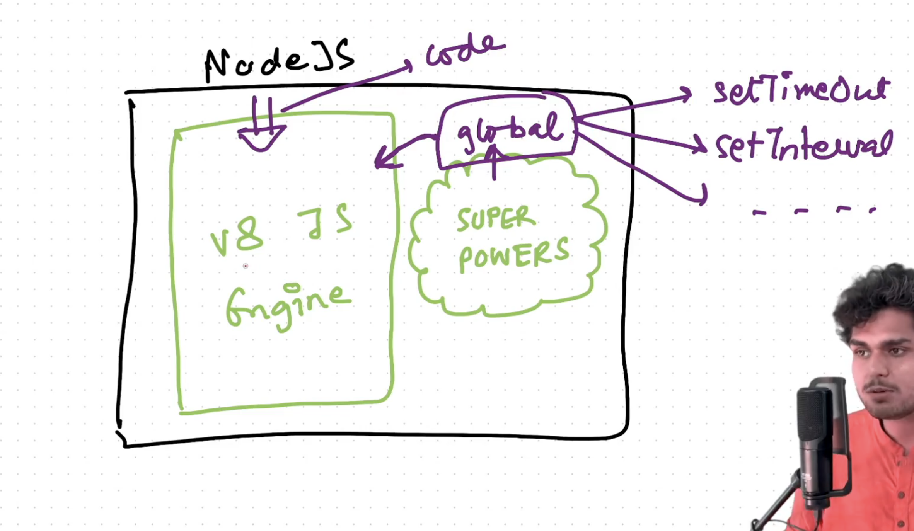

### Global Object in Node JS
- WIndow in browser is given to us by browsers not by V8 Engine.
- In Node js we have global object and it is called Global.
- This Global is part of NodeJS and not V8 Engine Thing. V8 ENgine gets access to global when nodejs provide access to it and it is one of the super powers of node js.
