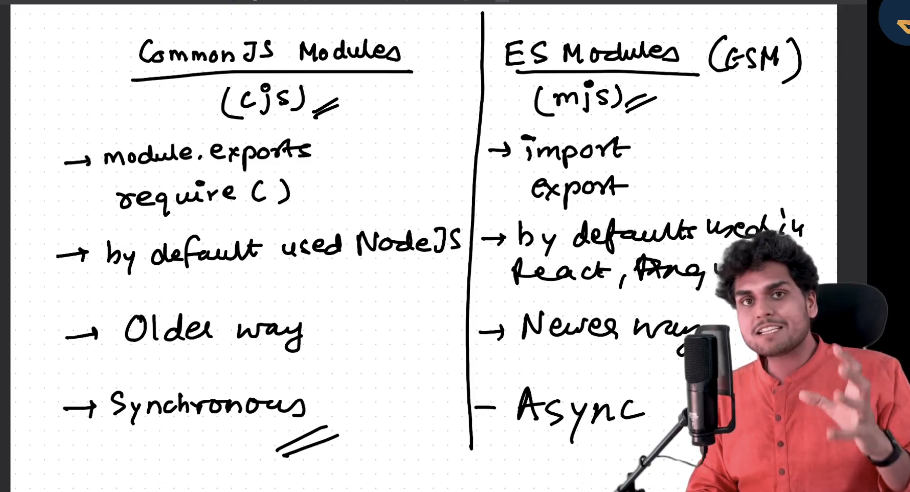

### Episode-4 :- module.export and require

#### Pattern 1 

- THis is referred as common JS Module (CJS). It doesn't require any package.json.
- It works in synchronous manner.
- Modules by default protects their variables and functions from leaking.
- This works in the non-strict.
- If we want to use the functions then we have to export these functions and then import them in the another file.
- If there is a function and a variable then we have export it on the form of a object and then import it by destructuring them.
- This protected property is imp because it prevent the error that could occur if we are redeclaring the same varibale in two different files.
- Remember in this that module.exports in a empty object here.

sum.js
console.log("Sum Module Executed");

var x = "Hello World";

function calculateSum(a, b) {
  const sum = a + b;
  console.log("Sum", sum);
}
module.exports = { x, calculateSum };

app.js
const { x, calculateSum } = require("./sum.js");
var a = "Shivam Dubey";
var b = 10;
var c = 20;
calculateSum(b, c);
console.log("X=", x);
console.log(a);
console.log(b + c);

#### Pattern 2

- This includes ES Modules (ESM) 
- It is a newwer way to export and import just like we use in react.
- It will become default in future but for now we are having CJS as default.
- THis require a packahe.json where we have to define that type:"module".
- It supports the async way also.
- This supports the strict mode.

What is a module ?
It is a collection of javscript code that is separate and private to itself.

