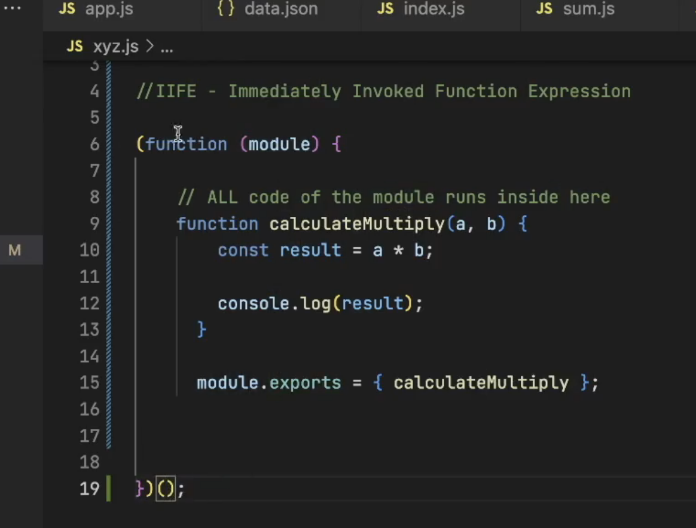
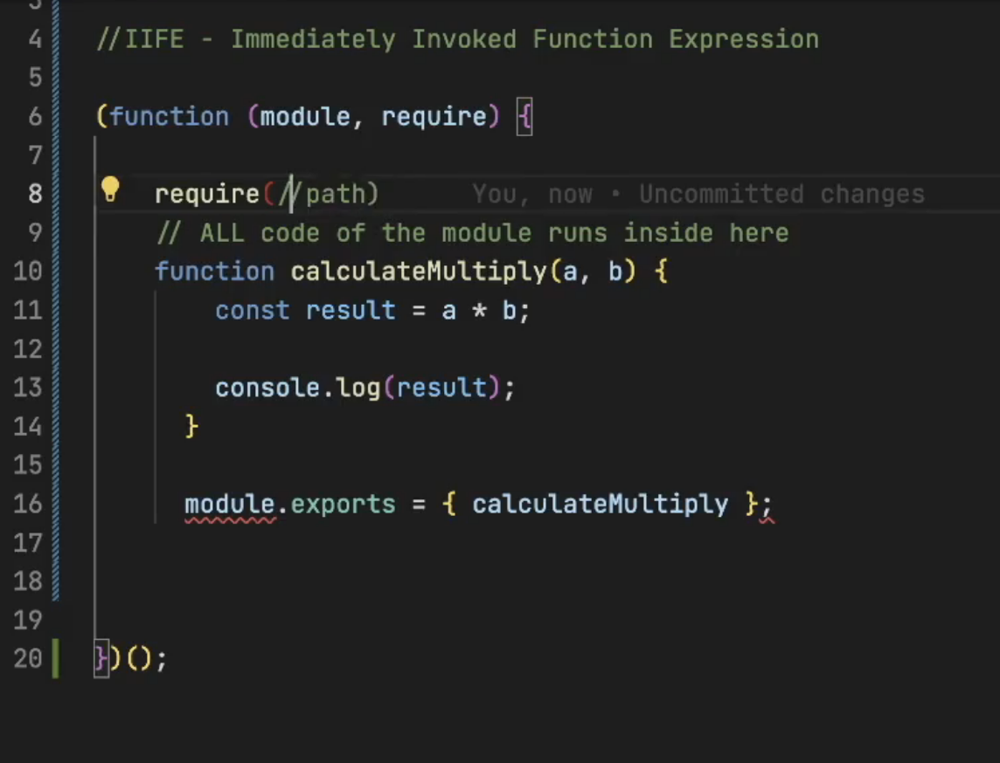
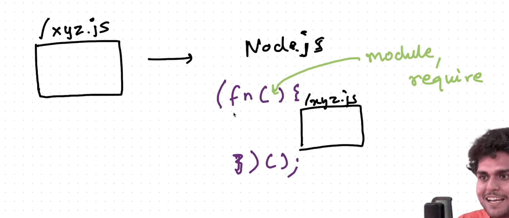
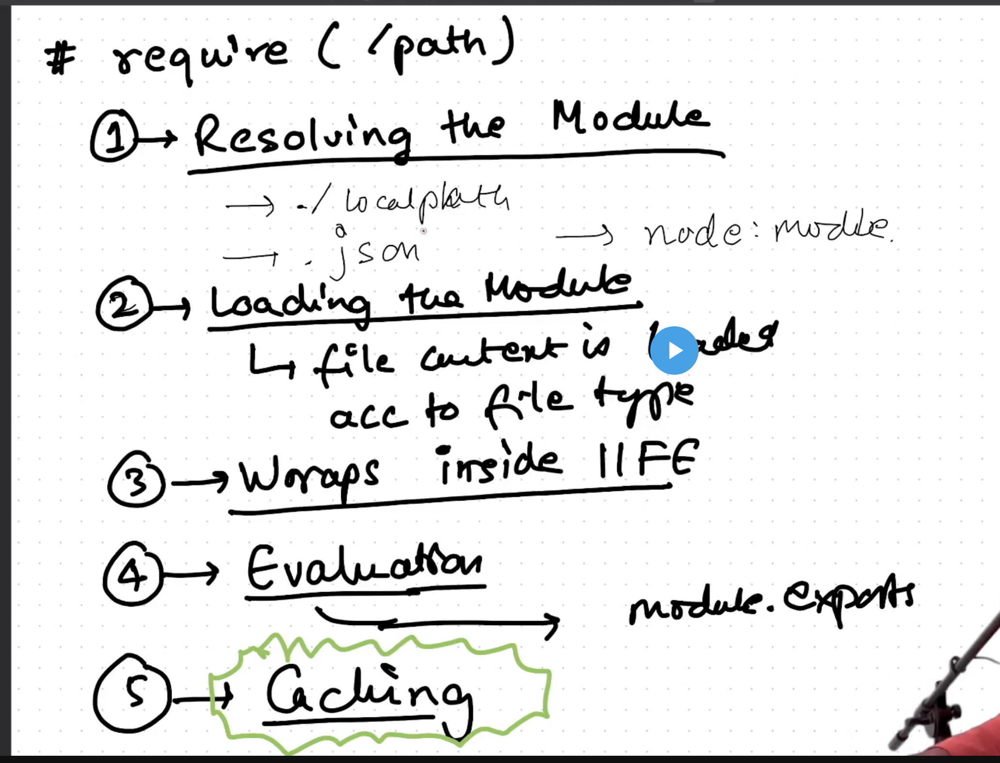

## Diving deep Into Node JS github repo 

1. If we write a function or a variable in the module then it gets wrapped inside the function and cannot be accessed outside until we are not using module.export.
2. WHat happen when we call require function 
require("./path")
then this will wrap the entire function body to into a IIFE that is Immediately Invoked function Expression.
that is like 
(function(){})();
3. It is beacuse it immediatley called the function code. It also keeps variables and function safe and private. It does not interfer.
4. It is the reason why functions and variables are private in different modules. It is because of the IIFE.
5. Question:- From where we are getting access to module.export :- Basically module.export is passed in the IIFE as parameter Node js.

6. Similarly require is also passed in the function

What happens when we use require behind the scenes 
There is a 5 step process that takes place 

-> Last one is V.IMP that is caching 
Caching :- Suppose there are many modules that are using the same require module.
So basically that module will be exported only once and then it is placed in the cache memory and whenever any module requires it them that same cached module is returned.
Because loading the module multiple times wil make your application slower.
