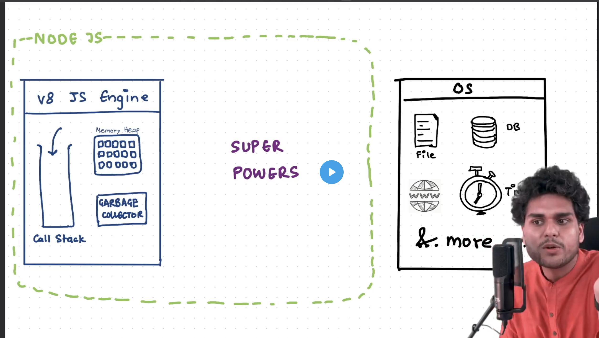
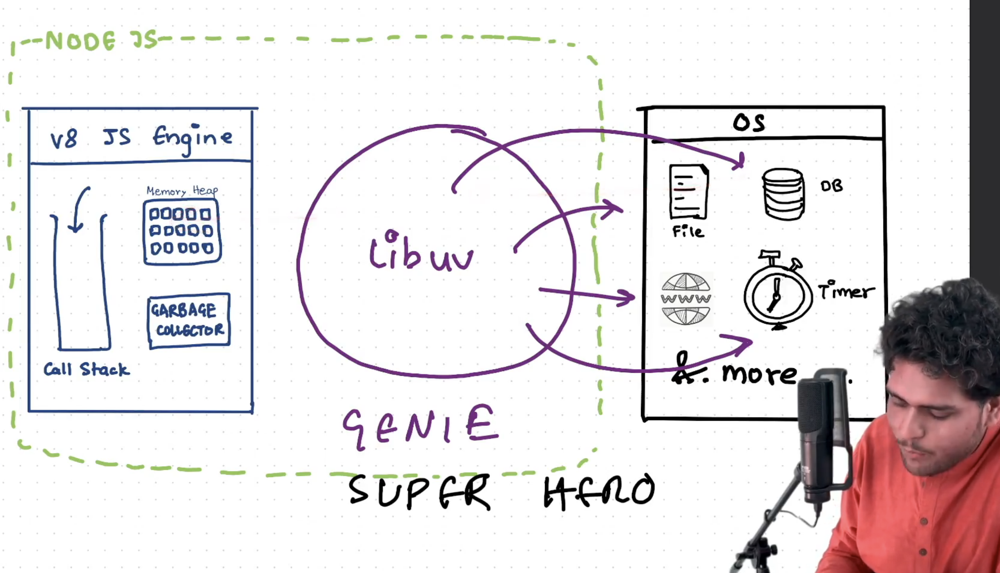
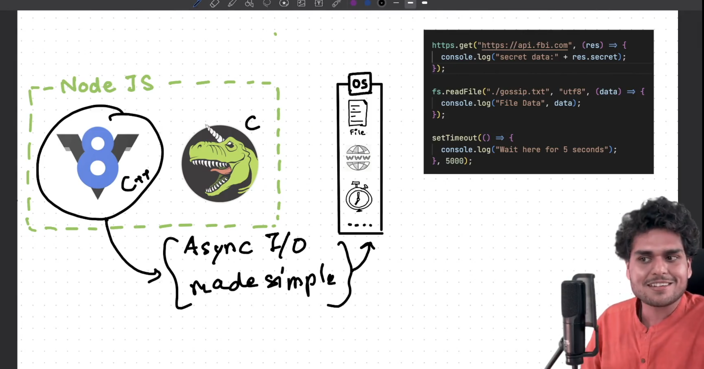
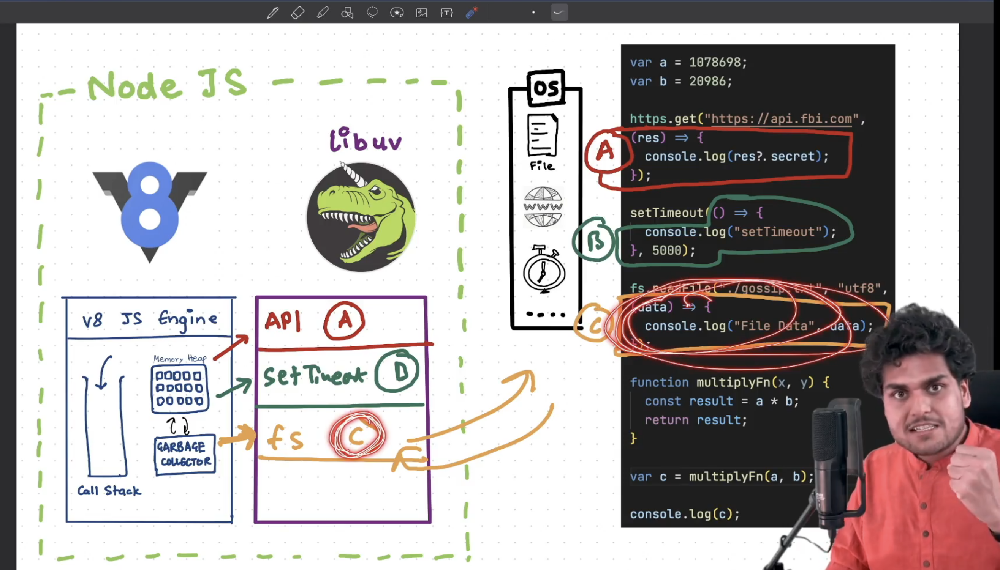

EPISODE-6 libuv and async io 

1. Node JS has an event driven architecture and capable of asynchronous I/O (Alos called as Non blocking IO as it is not blocking the main thread) but remember that V8 Engine is Synchronous.
2. We can say that node JS is having a non blocking IO that is why it is so fast.
3. Javascript Engine is not capable of doing the events like timeout. But with the help of the node it gets some super powers to execute these sort of events.

1. It is the Libuv library woith the help of which the V8 engine is able to communicate to the Operating Sytstem . It acts as a middle ware that takes all the requests for file access and other things and give them to the V8 engine.
2. Whenever the V8 sees that there is api call, file reading or settimeout it simply gives it to Libuv and moves ahad with the remaining code that it could execute.

