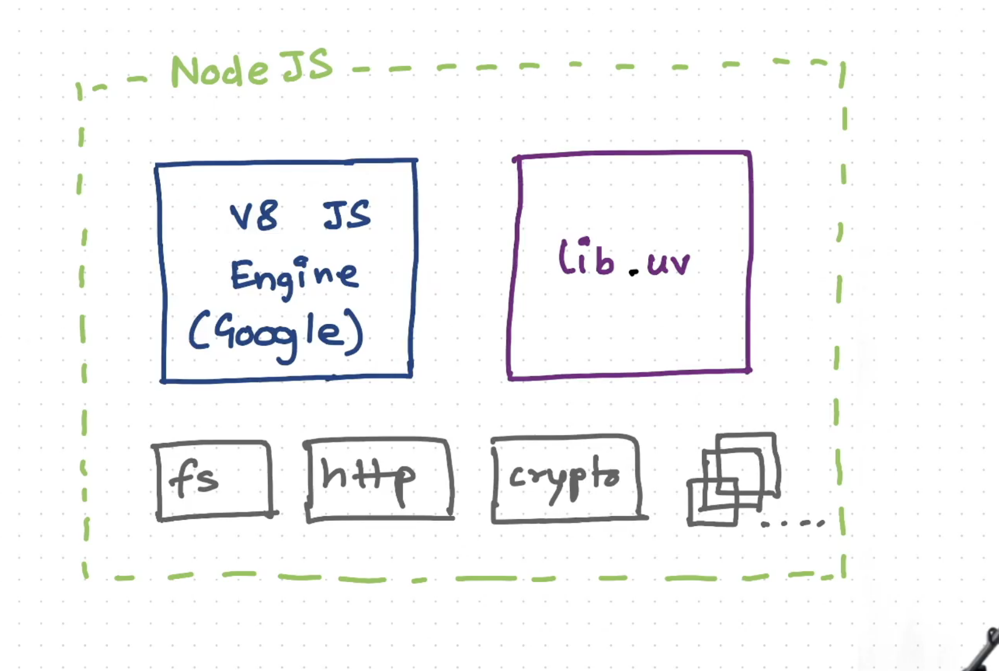
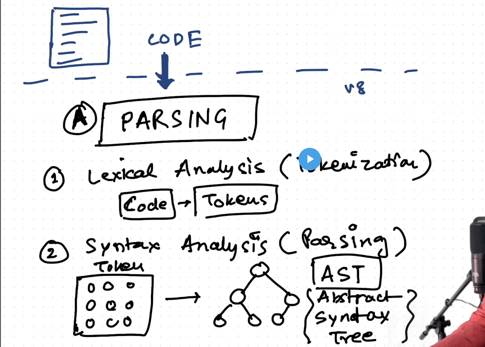
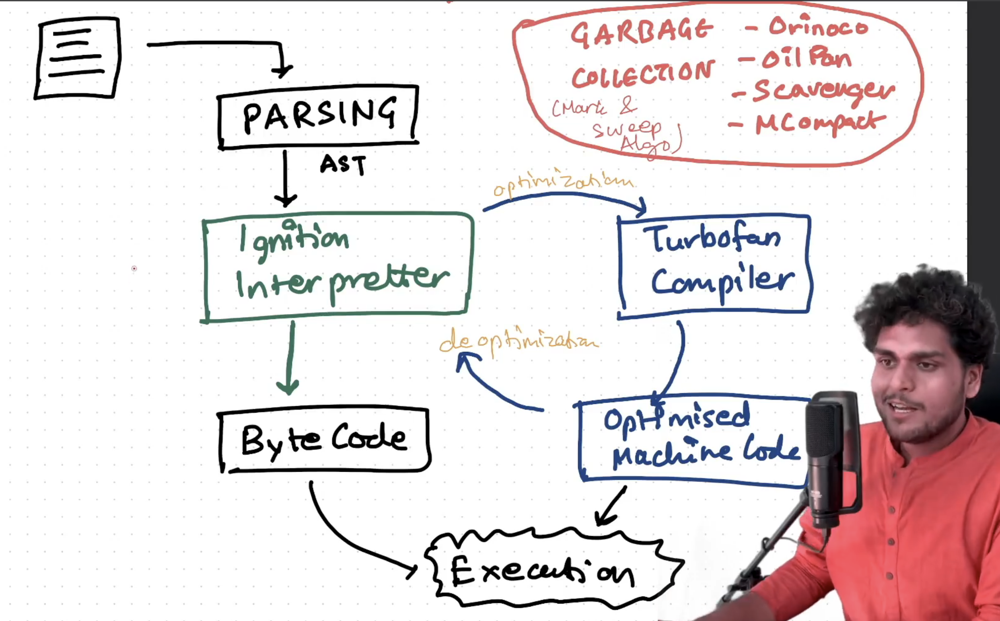
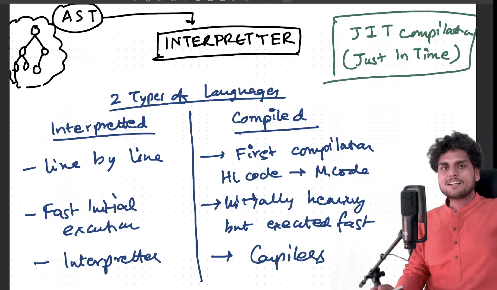

## Episode-8 Deep dive into v8 JS Engine

### What happen between code execution and final output 

1. **PARSING**:-
   1. **Lexical Analaysis**:- Code in broken down in tokens.It is also called tokenization.
   2. **Syntax Analysis**:- In this abstract syntax tree is created from the tokens.It is called Parsing.We get a syntax error because the comipler is not able to genrate the abstract syntax tree.
      1. After ASt generation it goes into interpreter.
      2. Name of the the interpreter is **ignititon interpreter**.
      3. There is also a use of compiler that is named as **TurboFan**
      4. So basically the interpreter convert the code into bytecode and then this bytecode is executed.
      5. Now there is some piece of code that is repeated and compiled again anad again so interpreter transfer that code to Turbofan compiler so that it could optimise that code and run it.
      6. THis transfer is called HOT HOle. 
      7. Now that turbo fan comipler  convert it into the Optimised Machine Code.
      8. The major drawback of interpreter was that it could not execute the code that fast but now it gives that code to turbo fan compiler and then that is optimised.
      9. SOmetimes code is deoptimised. WHile optimising tubrofan makes some assumptions.
      10. That is why it is said that always use the function that it is intended for like in the sum function always try to pass the interger only as it is a tough time for the compiler to deoptimise the Code.
    
   
   
   3. 

INTERVIEW QUESTIONS:- 

1. What is difference between Compiled Language and Interpreterd Language?
   Ans:- 
   Compiled Time :- Code is compiled from High level to machine level code. It is initailly heavy but executed faster. Here we have the compiler.
   Interpreted language:- In this execution takes place line by line.It is faster in initail execution. Here we have nterpreter.

   Now In case of javascript it uses both compiler and interpreter to work. It is called JIT Just in time compilation.
   
