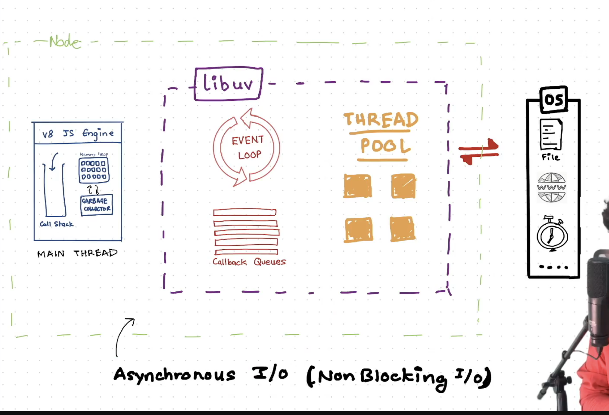
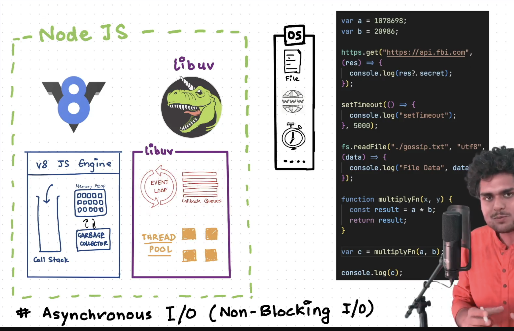
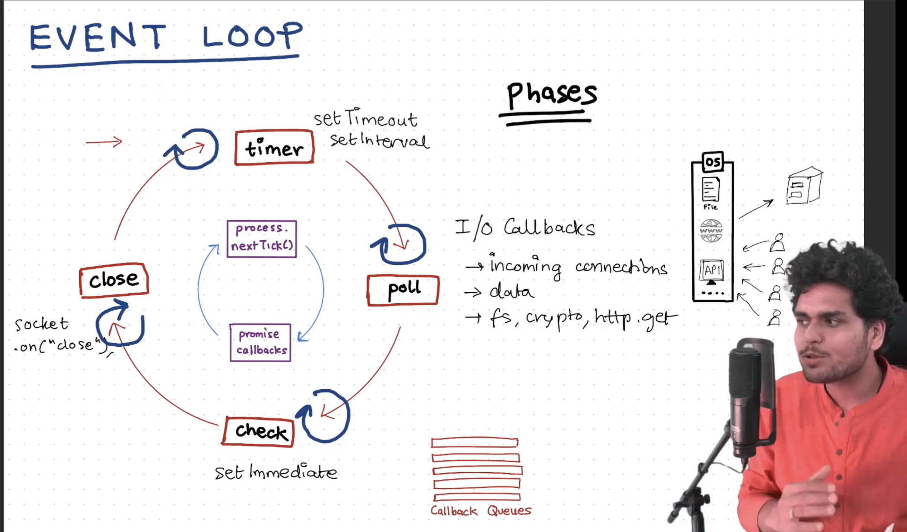
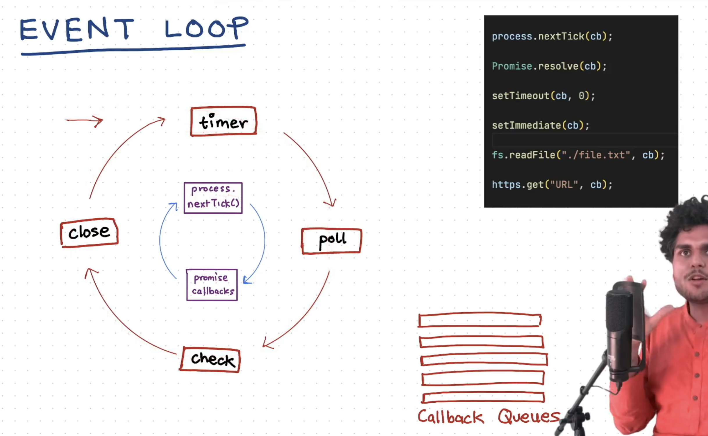
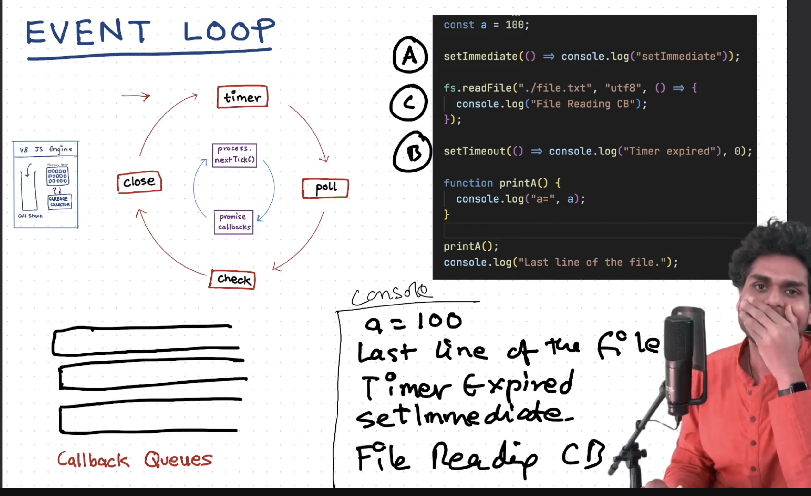
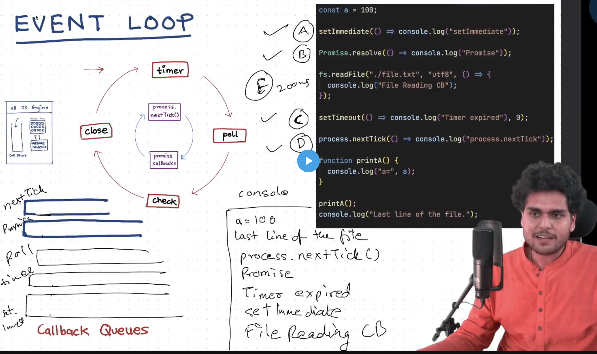
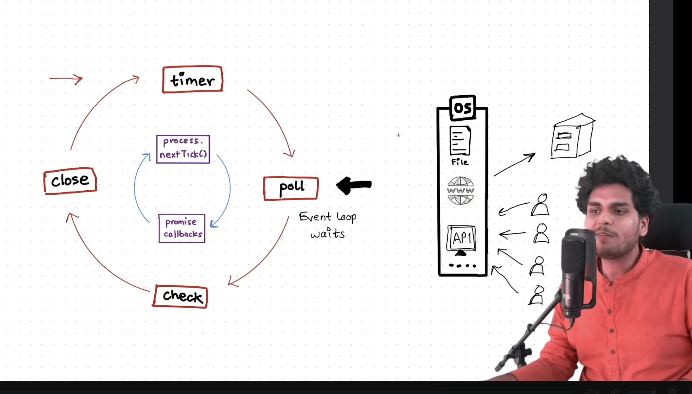
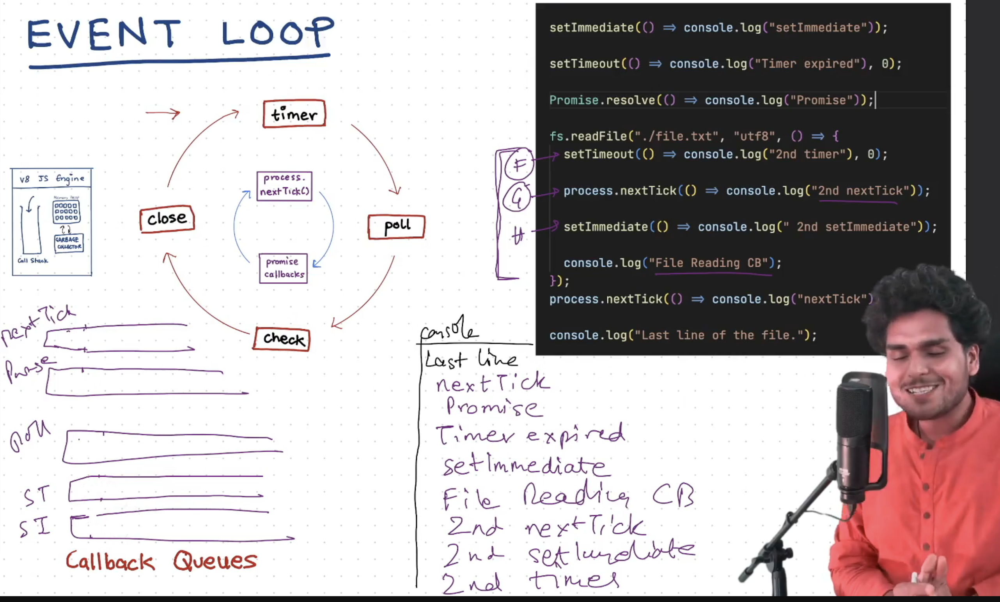
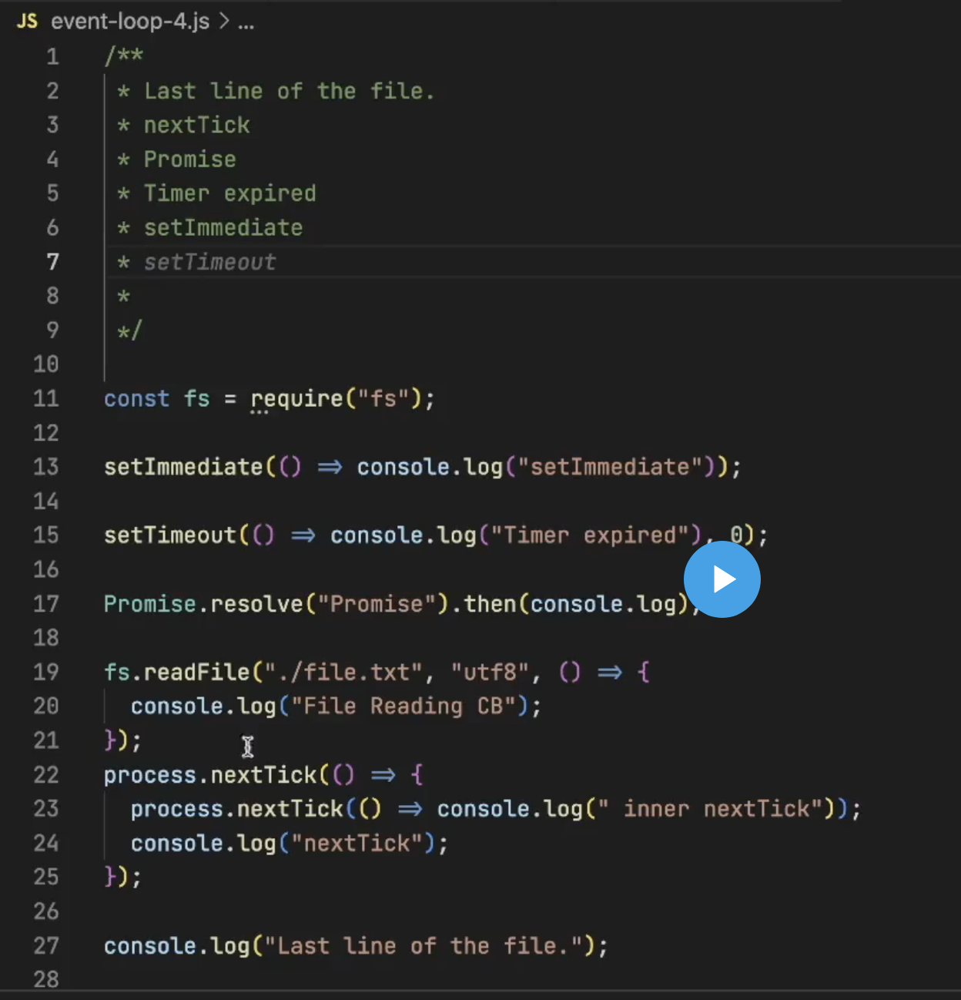
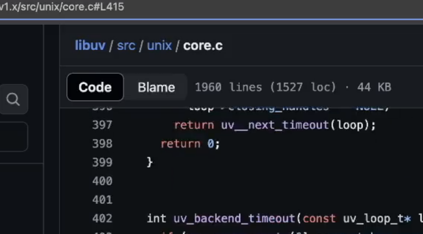

## Episode-09 | libuv & Event Loop

1. It is possible beause of the libuv that there is asynchronous I/o and non blocking i/o in node js.

2. If V8 engine is not ideal then the tasks that are pending has to wait in the callback queue of libuv.
3. There is a event loop in the Libuv and its function is to keep an eye on the call stack of V8 engine and whenever it finds that call stack is empty then it simply puts the callback function sinside that call stack. We can say it checks that main thread is not blocked or JS Engine is ideal or callstack is empty.
   

### Working of Event Loop.

1. Timer Phase :- Event loop prioritise this first. All the callbacks that are set by the setTImeout and setIntervals.
2. Poll Phase:- IN this all the callback asscoaited to I/O callbacks are executed in this phase.Most of the callbacks are handled in this phase.
3. Check Phase:- It handles the set Immediate.
4. Close Phase:- It this all close operations are executed in this phase like closing any socket 

All thse callbacks are waiting in the callback queues and waiting for the callstack to be empty.

- Now there are two cycles that are executed before each phase.These are process.nextTick() and promise callbacks.

- Basically on the basis of the above mentoined phases event loop executes the the processes and prioritize the execution of processes.

- Event loop waits at the poll phase if it has nothing to do.
- Event loop here is different from the event loop in browser.
 

There are two more stages in this cycle that are 

1. Pending Callbacks :- TO execute the pending I/O callbacks.
2. Idle,Prepare :- It is handled internally.

Note:- One full cycle of event loop in called one Tick.

Here we can get the code for this working 
