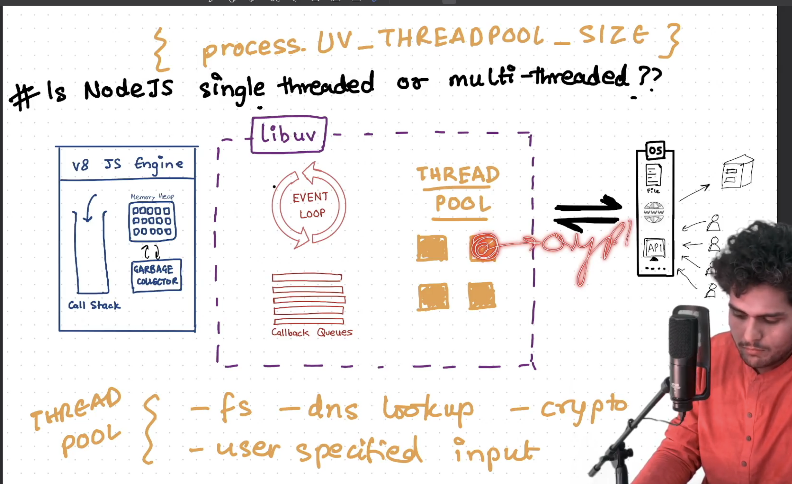
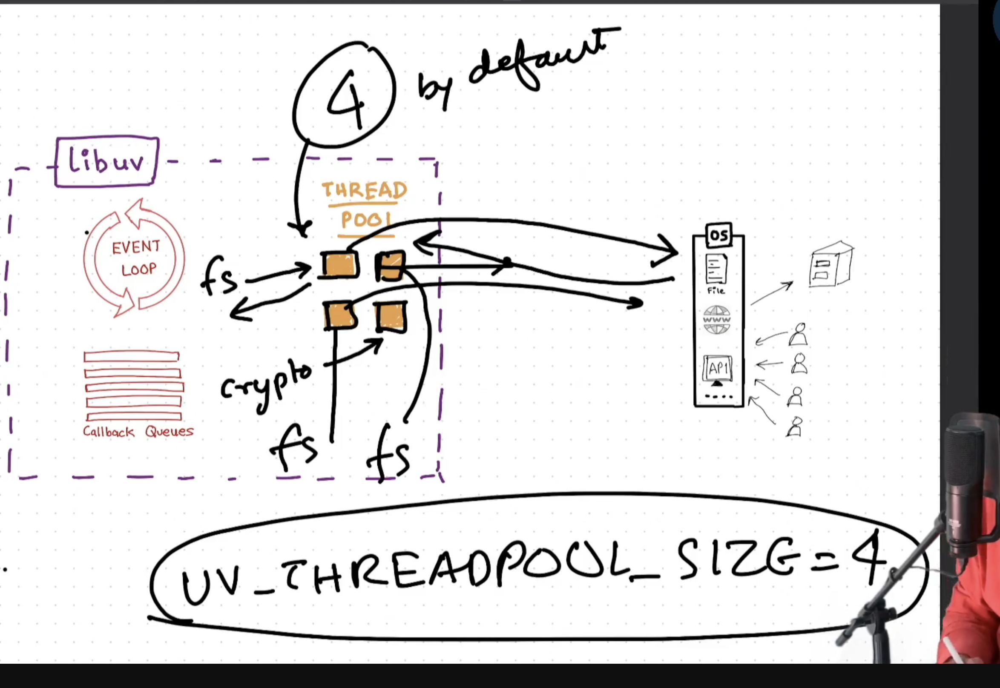

## Episode-10 | Thread pool in libuv

What are the threads?

- Threads can be assumed to be a container where processes executes.
- Whenever libuv needs to executes a process like file read or cryto it takes up the threads and executes the reading operation.
- By default libuv has 4 threads.

- If there are 5 operations and there are only 4 threads then that process has to wait.
- These are called as UV thread pool.
- Thread pulls are used for the specific operations only that are:- 

- Size of the thread pool can be changed by 
  process.env.UV_THREADPOOL_SIZE=<Number of thread pool required>

- API calls doesn't uses the thread pool.
- There is a epoll system that handles all these API or IO calls.

INTERVIEW QUESTION:- Is Noe JS a single threaded or multithreaded language.
Ans:- It depends upon the conditon. If there is synchronous code then it acts like a single threaded language but if there in asynchronous code then it acts like a multithreaded language and UV threads to execute different operations.

