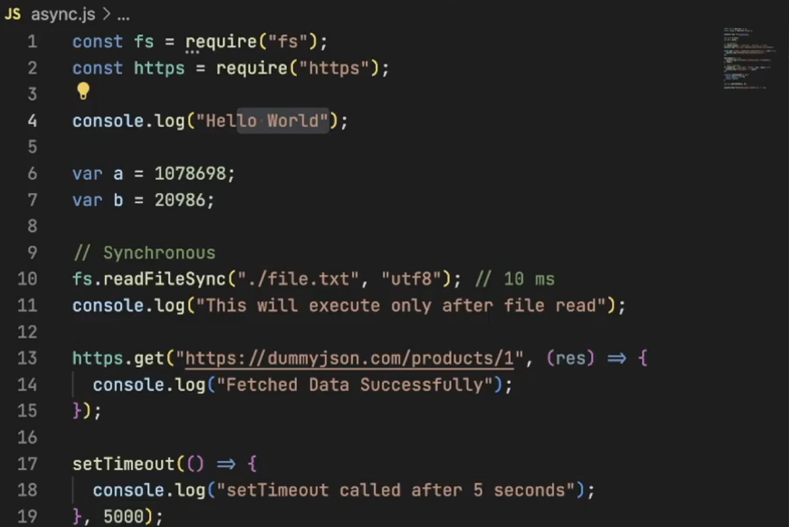

Episode-07 | sync, async, setTimeoutZero - code

1. If we create a sync function line readFileAsync then in that case also v8 engine will send the code to libuv and also it will block the main thread.
2. As a developer we should not use this synchronous functions.We should not use the blocking I/O.
    
3. Always remember that whether we have a setTimeout with 0 delay then also it will be called whenever the call stack of main thread is empty. 