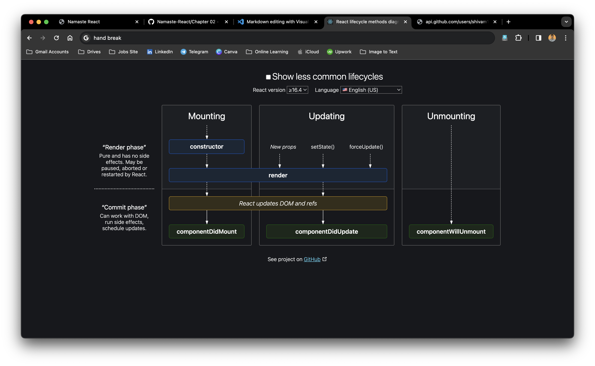

# Working with class based components (Imp interview questions)

1. Class based components is the simple javascript class.
2. Extend React.Component tells that it is a class based component and react start tracking it.
3. There is arender method that will return jsx code.
4. React.Component is a class and will come for react.

### How to pass props :- 

1. We create a constructor and than pass to super. 
class UserClass extends React.Component {
    constructor(props) {
        super(props);
        console.log(props.name)
    }

2. An to use that props we have to use this.props.name.

### How to create states :- 

1. use this.state in the constructor
2. For creating multiple state variables we can give in the same state.
3. To update the state variable.
4. Never update state variables directly like this.state.count=something. It will not update. Do like this 
            this.setState({
              count: this.state.count + 1,
            });
5. State variable is a big object and if we pass only soecific values than react will update only the specific value and it will not touch the value of other varibklle in the state.
  
## React LifeCycle Components:- 

Suppose there is About component and it is having a child component userInfo.
So when the parent About is rendered first constructor be called-> Render method is called-> Const of child-> Render of child-> `componentDidmount` of child->`ComponentDidMount` of Parent.

Parent ConstructorAbout->
Parent Render UserClass->
Child Constructor UserClass->
Child Render UserClass->
Child Component Did Mount About->
Parent Component Did Mount

`USE OF COMPONENT DID MOUNT` :- It is mostly used for API call. Because we first render and then make the api call instead of waiting for the api response.

So react want to quickly render a component and then make a api call and get the data.

#### `SPECIAL CASE `

If there are two child component than flow will be 

->Parent Cont

->Parent Render

-> Child1 Const

->Child1 render

->Child2 Const

-> Child2 Render

<DOM UPDATED - IN SINGLE BATCH>

-> Child1 compoennt did mount

-> Child2 component did mount

-> Parent component did mount.

Understand the react life cycle diagram.
https://projects.wojtekmaj.pl/react-lifecycle-methods-diagram/

Here is one reason why react is fast 

1. There is one `render phase` and `commit phase`.
2. Render phase include constructor and render and commit phase include updating dom and componentDidMount.
3. So first all the components render phase is called and then at last commit phase is called.
4. This is the react optimisation. Once render is completed than DOM manipulation takes place. SO react want to batch the render steps as DOM manipulation is very expensive.
5. So in render phase batching it takes all the changes and then the commit phase is done so that all the changes can be done at once.
   
Now after this what happen api calls are done and then again all the set states props are called and then again render takes place and then after that DOM refreshes again with new data and then `componentDidUpdate` is called.

`Basic life cycle is like `

`---------MOUNTING----------`

1. Constructor(dummy)
2. Render(dummy)
3. HTML (dummy)
4. Call to componentDidMount 
5. API call 
6. this.setState 
   
`--------UPDATE CYCLE--------`

1. render(API data)
2. HTML loaded with API data (user will see the details)
3. After this `componentDidUpdate` is called.

`--------UNMOUNTING CYCLE-----`

1. Here only componentWillUnmount will be called.

### Now comes the unmounting (componentWillUnmount)

This is called when we are going away or the component leave the html. 

### Some Imp points 

- `componentDidMount` called once after first render and `componentDidUpdate` is called after every render.
- In useEffect there is dependency array because earlier we have to compare the variables with previous values. SO they provide us that array so that we can enter multiple values.
- What to do in componentWillUnmount():- 
  * Clean up is done.
  * Suppose there is setInterval then we have to use clear interval ex:- clearInterval(this.timer)
  * In functional component we can do similar functionality by returning a array function inside the useEffect.
  
  useEffect(()=>{
    return ()=>{
      CODE THAT WE WANT DURING UNMOUNT
    }
  })

- Bad thing about SPA is that it never reloads the page so if we are having a timer or setInterval then it will keep on running.
- 

