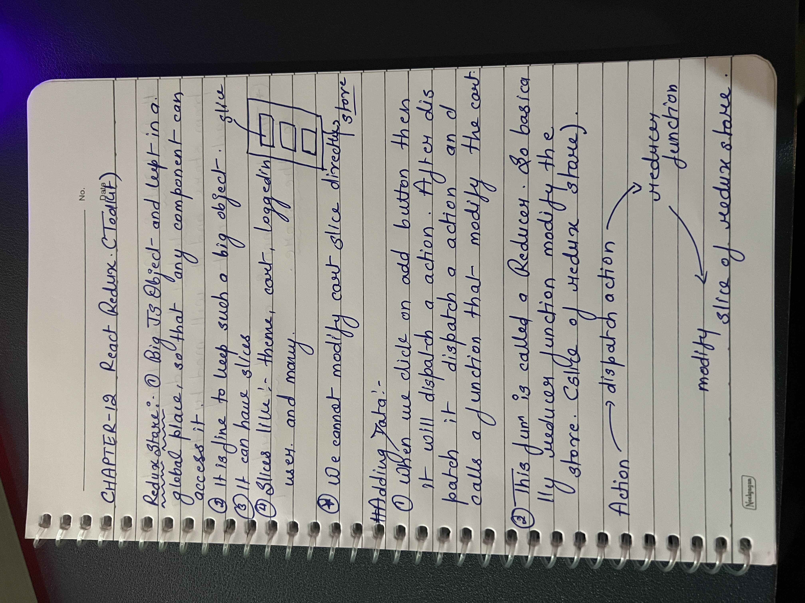
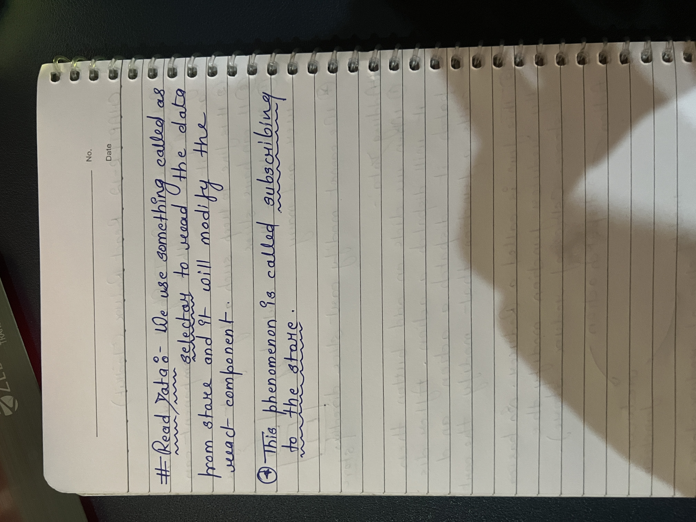
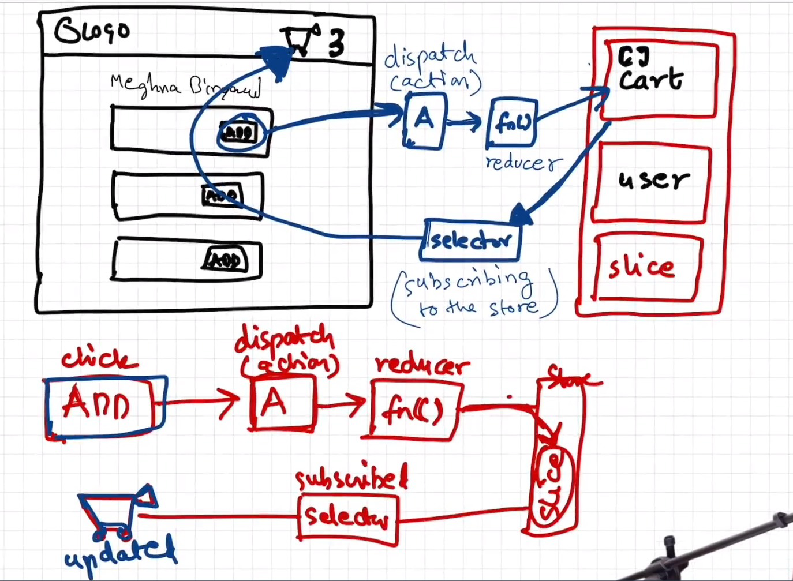
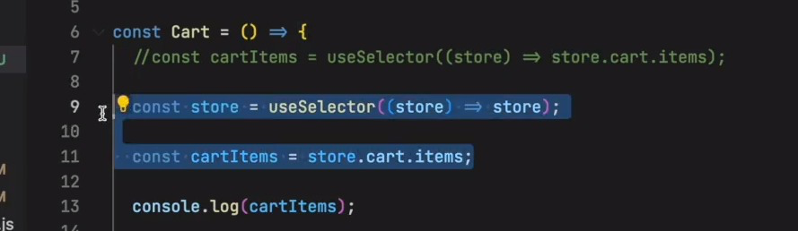

## REDUX CONCEPTS IN REACT

1. It works in the data layer of our react application.
2. Redux is used basically for the large applications. It is not mandatory to use.
3. Redux and React are separate libraries that is being imported in react project.
4. Redux is not only library that manage state. There is also zustand.
5. There are two libraries are :- React-Redux and Redux Toolkit.

### ADVANTAGES OF REDUX :- 

1. Our application become easier to debug like we can use the redux chrome extension.

#### Q. What is the diff between Vanilla Redux and Redux Toolkit?
Ans:- 
1. Vanilla redux was very complicated as compared to redux toolkit.
2. Later one requires to many packages and boilerplate code.

#### How React Redux works:- 
 

### INTERVIEW QUESTION:- 

1. If we do not subscribe to the right store portion then it is a big performance loss.
Always subscribe to the particular portion because if we subscribe the whole store then we will be getting the updates for whole store.
SO don't use like this 

2. Because the name is selector because we are subscribing to the selected portion of the store not the entire store.

3. In main store we use REDUCER but when we write slice so we use REDUCERS because they are multiple in number. So basically reducer is combination of reducers. 

4. In vanilla or older redux , we do not mutate the state and returning the newstate was mandatory. In Redux Toolkit we have to mutate the state. 

5. But if we are mutating the state, then redux is creating a immutable state. 
   
6. Redux is using immer library to take care of immutable state.

7. Read the redux docs for more info. Middlewares and thunks. But now with RTK we have RTK query. Try to make the API call.